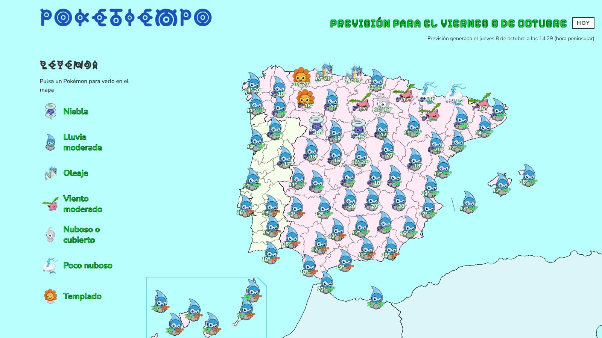

# PokéTiempo


### La previsión del tiempo, traducida al idioma Pokémon.

**[Ver PokéTiempo →](https://s-minaya.github.io/poke-tiempo/)**



Un sol, una nube y cuatro gotas estaban bien.

Pero podían ser un Charmander, un Castform y un Pokémon con bastante peor humor.

**PokéTiempo convierte la previsión de 74 lugares de España, Portugal y Andorra en un mapa donde cada condición meteorológica tiene su Pokémon.** No al azar: detrás hay datos reales, umbrales, prioridades y unas cuantas reglas para decidir quién se gana el sitio en el mapa.

La idea nace del **PokéTiempo original de Gabriel Ortega Díaz**. Esta es su adaptación web, desarrollada con permiso del propietario de la cuenta original y con una obsesión bastante poco razonable por conseguir que mapa, datos, accesibilidad y estética encajaran de verdad.

Porque sí: puedes venir solo a comprobar si mañana llueve.

Pero también puedes descubrir **qué Pokémon hace hoy**.

**React · TypeScript · SCSS · AEMET/IPMA/Open-Meteo · WCAG 2.2 AA · GitHub Actions · IA con guardas factuales**

---

## El mapa es el protagonista

Nada más entrar tienes la previsión delante: cada lugar, su Pokémon y, cuando hay espacio suficiente para mostrarlas bien, sus temperaturas.

A partir de ahí puedes:

- **Ir directamente a un lugar.** Tócalo en el mapa o ábrelo desde la lista para ver su Pokémon, qué condición representa y sus temperaturas.
- **Buscar casi como te salga.** Lugar, provincia, zona, Pokémon o condición. `coruna` encuentra A Coruña; las tildes no son una prueba de gimnasio.
- **Filtrar el mapa.** Por zona o pulsando una condición de la leyenda. Los lugares que quedan fuera no desaparecen: permanecen como siluetas para no perder el contexto geográfico.
- **Ordenar la previsión.** Por zona, alfabéticamente, de más calor a menos o de más frío a menos.
- **Saber qué estás mirando.** La fecha no queda escondida en letra pequeña: PokéTiempo te dice si esa previsión es de **HOY**, **MAÑANA** o se ha quedado **ATRASADA**.
- **Dejar hablar al Profesor Oak.** Cuando los datos están al día, puede recibirte con tres comentarios sobre la previsión.

El mapa incluye España —con Baleares, Canarias, Ceuta y Melilla—, Portugal y Andorra.

---

## ¿Por qué ese Pokémon?

Una ciudad no tiene una sola cosa pasando a la vez.

Puede hacer calor, llover, soplar viento fuerte y tener un aviso costero el mismo día. PokéTiempo evalúa temperatura, cielo, lluvia, nieve, viento, tormenta, calima, niebla, oleaje y avisos oficiales. Cada uno puede proponer su Pokémon.

Después toca decidir quién sale al mapa.

Ahí entra una prioridad fija: un fenómeno importante gana a uno más cotidiano. Un aviso rojo costero pesa más que una tormenta; una tormenta, más que la lluvia; y la lluvia, más que un día simplemente templado.

En total hay **25 condiciones posibles**. Algunos ejemplos:

| Pokémon | Condición | Cuándo |
|---|---|---|
| Charmander | Caluroso | Máxima de más de 25 °C y hasta 29 °C |
| Dragonite | Viento intenso | Viento sostenido de 40 a menos de 60 km/h |
| Zapdos | Tormenta | Hay tormenta prevista |
| Castform | Niebla | Hay niebla prevista |
| Gyarados / Mega Gyarados | Oleaje / Oleaje muy fuerte | Olas desde 1,25 m / desde 2,5 m, o aviso rojo costero |

La leyenda solo muestra los Pokémon que realmente aparecen ese día.

Las temperaturas del mapa se colorean por franjas y llevan contorno para seguir siendo legibles sobre sprites y fondos distintos. Las mismas franjas sirven para organizar la lista cuando se ordena por calor o por frío.

No es una Pokédex con meteorología pegada encima: la asignación está definida en código y probada en sus límites.

Si quieres bajar a la madriguera:

- [`assign-pokemon.ts`](src/domain/assign-pokemon.ts) — reglas de asignación;
- [`pokemon-labels.ts`](src/domain/pokemon-labels.ts) — textos de la leyenda;
- [`map-priority.ts`](src/domain/map-priority.ts) — quién se gana el sitio en el mapa.

---

## No todo es «hoy»

Una previsión meteorológica sin fecha es casi una trampa.

PokéTiempo prepara una previsión diaria para el día siguiente según `Europe/Madrid`, pero después **la fecha del dataset es la que manda** en toda la aplicación.

La cabecera indica siempre qué estás viendo:

- **HOY** — la previsión corresponde al día actual;
- **MAÑANA** — corresponde al día siguiente;
- **ATRASADA** — la actualización diaria no ha llegado a tiempo.

Si el retraso aumenta, aparece además un aviso antes del mapa.

La previsión anterior no desaparece ni intenta hacerse pasar por nueva: sigue disponible con su fecha real.

Y si dejas la página abierta el tiempo suficiente para que esos datos se queden atrás, PokéTiempo puede ofrecerte recargar **para comprobar** si hay una versión más reciente.

La palabra importante es *comprobar*.

El navegador no hace ninguna petición en segundo plano para averiguarlo. Solo conoce la fecha de los datos que ya tiene y la compara con el día actual en Madrid.

**Lo que ves tiene fecha. Siempre.**

---

## Oak puede hablar. No puede inventarse el tiempo.

Al pulsar **EMPEZAR**, si la previsión está al día, el Profesor Oak puede aparecer con tres comentarios sobre el mapa que vas a ver.

Se leen como en los juegos: texto progresivo, su pequeño *blip* y avance con clic, toque, Intro o Espacio.

Había una tentación bastante obvia: darle toda la previsión a una IA y pedirle que improvisara.

Así que hice exactamente lo contrario.

```text
forecast.json
  ↓
hechos meteorológicos
  ↓
plan del día
  ↓
afirmaciones ya resueltas
  ↓
Groq pone la voz
  │
  └── o fallback local
  ↓
guardas y validación
  ↓
oak-today.json
```

La IA **no decide qué tiempo hace**.

Antes de llegar a Groq ya están resueltos los lugares, temperaturas, Pokémon, fenómenos y avisos sobre los que Oak puede hablar. El modelo recibe esas afirmaciones y les da forma de diálogo.

Después, el resultado todavía tiene que pasar varias guardas.

Si aparece una cifra que no existía, un Pokémon distinto, un aviso que no estaba permitido o expresiones problemáticas como «esta tarde», el texto se rechaza.

¿Por qué también se vigilan expresiones aparentemente inocentes como «hoy»? Porque el diálogo puede generarse un día y seguir almacenado cuando alguien abra la página al siguiente.

Si Groq no responde, falta la clave o el texto no pasa la validación, Oak tampoco entra en pánico: existe un **fallback local y determinista**.

Y cuando hay avisos naranjas o rojos, el propio plan del día elimina el tono bromista antes de llegar a la IA.

**La IA escribe. El dominio manda.**

Oak tampoco aparece si la previsión está atrasada, si sus diálogos no pertenecen a la misma fecha del mapa o si no se puede demostrar que son válidos. En esos casos, EMPEZAR lleva directamente a la previsión.

---

## Que funcione bien también era parte del diseño

PokéTiempo tiene un mapa bastante poco amable con las pantallas pequeñas: 74 lugares, sprites, temperaturas, una leyenda, filtros, tarjetas y una lista completa.

La solución no fue hacerlo todo diminuto.

**La composición cambia cuando deja de caber.**

### Responsive

- **Composición apilada:** cabecera, mapa, leyenda y lista.
- **Desde 1200 px, escritorio compacto:** el mapa conserva el tamaño mínimo necesario para que las temperaturas sigan siendo legibles.
- **Dos columnas:** solo aparecen cuando realmente caben una leyenda y un mapa con temperaturas uno al lado del otro.
- **Pantallas muy grandes:** el contenido deja de crecer a 1600 px, pero hasta 2090 px el mapa llega al borde derecho de la ventana, la lista a los dos y, desde 1916 px, la leyenda se reparte en dos columnas hasta el izquierdo. Los fondos de la lista y el pie continúan siempre hasta los bordes, para que la interfaz no termine flotando en mitad del monitor.

El breakpoint de dos columnas no está elegido porque «1372 parecía buena idea».

Se calcula a partir del ancho de la leyenda, el tamaño mínimo que necesita el mapa para mostrar las temperaturas y un margen para la barra de desplazamiento. Si el usuario aumenta el tamaño base del texto, las dos columnas aparecen más tarde.

La composición se decide en CSS. No hay JavaScript preguntando cuánto mide la ventana.

### Accesibilidad

La accesibilidad tampoco llegó al final como una checklist que había que aprobar antes de entregar.

El proyecto se ha contrastado criterio a criterio contra **WCAG 2.2 AA**. La auditoría completa está documentada en [`008-plan.md`](spec/features/008-responsive-and-accessibility/008-plan.md).

Entre otras cosas:

- **Navegación completa con teclado.** Portada, Oak, leyenda, 74 marcadores, tarjetas, filtros, buscador, ordenación y lista.
- **Foco visible.** Los controles utilizan un indicador de alto contraste que no queda escondido por sprites ni tarjetas.
- **Mapa también en texto.** Cada marcador tiene un nombre accesible con lugar y temperaturas, y la lista ofrece la misma información sin depender del SVG.
- **Regiones vivas.** Se anuncian cambios como el lugar seleccionado, el número de resultados, los diálogos de Oak o la frescura de la previsión.
- **Pruebas con Narrador + Edge.**
- **Zoom y reflow.** Probado al 200 %, a 320 px CSS y con los requisitos de espaciado de texto de WCAG 1.4.12.
- **Contraste medido.** En textos, controles, temperaturas y foco.
- **Objetivos táctiles.** Los controles principales persiguen 44 × 44 px; cuando un marcador visual es demasiado pequeño, la misma acción sigue disponible mediante su fila accesible.
- **`prefers-reduced-motion`.** El rebote de EMPEZAR, la flecha de Oak, la máquina de escribir y otras transiciones se reducen o desaparecen.
- **La información no depende solo del color.** Pokémon, texto, iconografía y estados adicionales acompañan a los cambios cromáticos.
- **Sprites realmente decorativos.** Los Pokémon del mapa viven en una capa separada, fuera del árbol accesible y sin interceptar el puntero.

Los sprites pueden ser bonitos sin intentar robarle el foco al contenido. Literalmente.

---

## De dónde sale la previsión

**El navegador no llama a ninguna API meteorológica ni a la IA.**

Todo se prepara previamente mediante GitHub Actions y llega a la web como datos estáticos incluidos en la aplicación.

```text
AEMET · IPMA · Open-Meteo · Open-Meteo Marine
                 + avisos oficiales
                        ↓
               fetch:forecast
                        ↓
              normalizar y combinar
                        ↓
                 validar 74/74
                        ↓
               forecast.json
                        ↓
                 generate:oak
                        ↓
        oak-today.json · oak-history.json
                        ↓
                lint · tests · build
                        ↓
                   GitHub Pages
```

### Una fuente por zona

- **España:** [AEMET OpenData](https://opendata.aemet.es/centrodedescargas/inicio), para 65 lugares.
- **Portugal:** [IPMA](https://www.ipma.pt/), para 8 lugares.
- **Andorra:** [Open-Meteo](https://open-meteo.com/).

Open-Meteo también completa datos que las otras fuentes no proporcionan de la misma forma, como lluvia y nieve en España o viento en Portugal.

[Open-Meteo Marine](https://open-meteo.com/en/docs/marine-weather-api) proporciona la altura de ola para los lugares costeros, y los avisos oficiales de AEMET e IPMA se obtienen por separado.

Cada proveedor habla su propio idioma —códigos de AEMET, IPMA, WMO...— y el pipeline los traduce al mismo dominio antes de que React vea nada.

### ¿Y si algo falla?

Open-Meteo puede actuar como respaldo cuando falla una fuente principal.

Pero el sistema tampoco intenta publicar «más o menos lo que haya podido conseguir».

La regla final es **74 de 74**.

Si después de aplicar los respaldos falta un lugar o alguno no puede recibir al menos un Pokémon, el pipeline no escribe la nueva previsión y la web conserva la última válida.

Un error de credenciales de AEMET tampoco se oculta detrás del fallback: aborta.

Los JSON resultantes están versionados en el propio repositorio y el bot deja un commit cuando publica nuevos datos.

---

## Bajo el capó

No hay una arquitectura diseñada para resolver problemas que PokéTiempo no tiene.

- **React 19 + TypeScript**
- **Vite**
- **Sass / SCSS con BEM**
- **Vitest + React Testing Library**
- **jsdom** para componentes
- **d3-geo** durante la generación del mapa
- **tsx** para scripts de Node
- **ESLint + Stylelint**
- **GitHub Actions**
- **GitHub Pages**
- **Groq** para la voz de Oak

Es una SPA sin router, sin gestor global de estado y sin backend de aplicación.

La previsión ya llega preparada en JSON. `d3-geo`, por ejemplo, no se lleva al navegador para reproyectar el mapa cada vez que alguien entra: las coordenadas se calculan antes.

### Una fuente Unown porque, al parecer, usar una normal era demasiado fácil

La tipografía del título también está hecha específicamente para PokéTiempo.

Y no, no encontré simplemente un `.woff` bonito y lo instalé.

Fui buscando **letra por letra el alfabeto Unown en imágenes**, reconstruyendo los glifos y convirtiéndolos después en una fuente que pudiera utilizar directamente en la interfaz.

Todo ese trabajo para escribir unas cuantas palabras.

**Por eso había que hacerlo.**

`Poketiempo Unown` forma parte de la identidad visual del proyecto. Su diseño reproduce el alfabeto Unown de Pokémon y, como el resto de elementos de la franquicia, se utiliza dentro del carácter fan y no oficial explicado en las atribuciones.

---

## Levantar PokéTiempo en local

El workflow utiliza **Node 22**; usar la misma versión en local es la forma más directa de reproducir el entorno del proyecto.

```bash
git clone https://github.com/s-minaya/poke-tiempo.git
cd poke-tiempo

npm ci
npm run dev
```

La aplicación se abre en:

```text
http://localhost:5173/poke-tiempo/
```

Para desarrollar la interfaz **no necesitas ninguna API key**: el repositorio ya contiene una previsión válida.

### Comandos habituales

| Comando | Qué hace |
|---|---|
| `npm run dev` | Servidor de desarrollo |
| `npm run build` | Build de producción en `dist/` |
| `npm run preview` | Sirve la build local |
| `npm run lint` | ESLint + Stylelint |
| `npm run test` | Ejecuta la suite |
| `npm run test:watch` | Tests en modo watch |
| `npm run test:coverage` | Genera cobertura en `coverage/` |

### Regenerar una previsión

Solo hace falta si quieres trabajar con datos meteorológicos nuevos:

```bash
cp .env.example .env
```

Después añade las credenciales necesarias y ejecuta:

```bash
npm run fetch:forecast
npm run generate:oak
```

`fetch:forecast` necesita `AEMET_API_KEY`.

`generate:oak` puede utilizar `GROQ_API_KEY`, pero no depende de ella para funcionar: sin Groq genera el fallback local.

Las claves nunca utilizan el prefijo `VITE_`, porque no deben acabar en el bundle del navegador.

Ambos scripts modifican archivos versionados dentro de `src/data/`.

---

## Que no se rompa al evolucionar

La suite no intenta comprobar únicamente que los componentes «rendericen».

Se prueban las reglas que podrían cambiar silenciosamente el significado de la aplicación:

- límites de temperatura y **asignación de Pokémon**;
- prioridad de condiciones en el mapa;
- clientes de **AEMET, IPMA, Open-Meteo y Open-Meteo Marine** con respuestas capturadas;
- avisos oficiales;
- combinación de fuentes y fallbacks;
- comportamiento cuando faltan datos;
- cálculo de fechas en `Europe/Madrid`, incluidos cambios de hora;
- estados **HOY / MAÑANA / ATRASADA**;
- búsqueda sin tildes;
- filtros y ordenación;
- selección desde mapa y lista;
- nombres accesibles y regiones vivas;
- hechos y afirmaciones de Oak;
- fallback local;
- historial;
- guarda factual;
- expresiones temporales prohibidas;
- adaptador de Groq;
- breakpoint de escritorio derivado de sus medidas reales;
- orden de las capas del SVG para que ningún sprite tape temperaturas o foco;
- los 74 lugares y sus zonas.

Lo que jsdom no puede medir —zoom, composición real, contraste, focos visualmente ocultos, lectores de pantalla...— se ha comprobado también en navegador y queda documentado junto a las features correspondientes.

---

## De `main` a GitHub Pages

El despliegue vive en [`.github/workflows/deploy.yml`](.github/workflows/deploy.yml).

### Actualización diaria

Una ejecución programada:

1. descarga la nueva previsión;
2. genera los diálogos de Oak;
3. pasa lint, tests y build;
4. actualiza los JSON versionados;
5. crea el commit de datos;
6. despliega en GitHub Pages.

GitHub puede retrasar una ejecución programada, por eso la interfaz nunca asume silenciosamente que los datos son actuales: vuelve a entrar en juego la fecha del dataset.

### Push a `main`

Cada push pasa igualmente por:

```text
lint → tests → build → deploy
```

pero utiliza los datos que ya estén versionados. No solicita una nueva previsión.

También existe ejecución manual mediante `workflow_dispatch`.

Si algo falla antes de publicar los datos nuevos, la previsión anterior permanece online.

---

## Cómo se construyó

PokéTiempo se desarrolló por **features**, cada una con su propia spec, plan y lista de tareas versionadas.

No hace falta leerse todo eso para entender el proyecto, pero si quieres ver las decisiones y verificaciones detrás de cada parte:

- [`spec/`](spec/)
- [`AGENTS.md`](AGENTS.md)

Ahí está buena parte de la historia del proyecto: qué se quería conseguir, por qué se tomó cada decisión y cómo se comprobó después.

---

## Lo que PokéTiempo no intenta ser

También ayuda saber qué **no** hace.

- No es tiempo en directo: es una **previsión diaria con fecha**.
- No consulta APIs meteorológicas mientras navegas.
- No consulta a ninguna IA desde el navegador.
- No comprueba online en segundo plano si existe una previsión más reciente.
- No incluye todos los municipios: trabaja con **74 lugares** procedentes de la selección original.
- El mapa no tiene zoom ni desplazamiento propios.
- No hay cuentas de usuario.
- No hay favoritos.
- No hay historial personal.
- No usa `localStorage` para guardar actividad.
- No incluye analítica.
- No tiene anuncios ni monetización.
- Actualmente está solo en español.

Y, sobre todo, **no es un servicio meteorológico oficial**.

Los datos vienen de fuentes meteorológicas reales y se citan, pero PokéTiempo es una forma distinta de representarlos.

La gracia está en saber si va a llover.

Y en descubrir quién ha aparecido para contártelo.

---

## Créditos, datos y alguna criatura ajena

### PokéTiempo original

La idea original de **PokéTiempo** es de **Gabriel Ortega Díaz**.

Esta adaptación web se ha desarrollado con permiso del propietario de la cuenta original.

### Código

El código de esta web pertenece a este proyecto.

Actualmente el repositorio **no incluye una licencia general para su reutilización**.

### Datos meteorológicos

- **España:** [AEMET OpenData](https://opendata.aemet.es/centrodedescargas/inicio)
- **Portugal:** [IPMA](https://www.ipma.pt/)
- **Andorra, datos complementarios y oleaje:** [Open-Meteo.com](https://open-meteo.com/), bajo [CC BY 4.0](https://creativecommons.org/licenses/by/4.0/)

Los datos se transforman y adaptan para su representación en PokéTiempo.

La atribución también aparece directamente bajo el mapa:

> Datos meteorológicos: AEMET · IPMA · Open-Meteo.com (CC BY 4.0), adaptados para el mapa.

### Mapa

La geometría procede de [Natural Earth](https://www.naturalearthdata.com/), cuyos datos son de dominio público.

Se utiliza la conversión GeoJSON de [martynafford/natural-earth-geojson](https://github.com/martynafford/natural-earth-geojson), publicada bajo CC0.

### Tipografías

**[Pixelify Sans](https://fonts.google.com/specimen/Pixelify+Sans)** y **[Nunito Sans](https://fonts.google.com/specimen/Nunito+Sans)** se utilizan bajo la SIL Open Font License 1.1.

**Poketiempo Unown** es una fuente creada específicamente para el proyecto a partir del diseño visual del alfabeto Unown.

### Imágenes y sonidos

| Recurso | Origen |
|---|---|
| Sprites de Pokémon (`src/assets/sprites/`) | Encontrados en internet |
| Retrato neutral del Profesor Oak | Encontrado en internet |
| Otras cinco poses del Profesor Oak | Dibujadas por mí en Procreate tomando como referencia el retrato neutral |
| Ilustraciones de portada (`src/assets/shared/background-*.jpg`) | Dibujadas por mí en Procreate |
| Favicon (`public/favicon-*.png`) | Dibujado por mí en Procreate |
| `game-start.mp3` | Pixabay |
| `oak-text-blip.mp3` | Pixabay |

### Pokémon

PokéTiempo es un proyecto fan y no oficial. No está afiliado a los titulares de los derechos de Pokémon ni cuenta con su patrocinio. Pokémon, sus personajes y sus nombres pertenecen a sus respectivos titulares.

---

## Detrás del mapa

**Diseño y desarrollo: Sofía Minaya.**

Frontend, datos, accesibilidad, automatizaciones, dibujos en Procreate y una cantidad poco razonable de tiempo buscando **cada letra del alfabeto Unown una por una** para terminar convirtiéndolas en una fuente.

PokéTiempo empezó siendo una idea que me hacía gracia y acabó siendo uno de esos proyectos en los que cada vez que pensaba «ya está» encontraba una cosa más que quería hacer bien.

Si has llegado hasta aquí, gracias por echarle un vistazo.

**Ahora solo queda saber qué Pokémon hace hoy. → [Abrir PokéTiempo](https://s-minaya.github.io/poke-tiempo/)**
